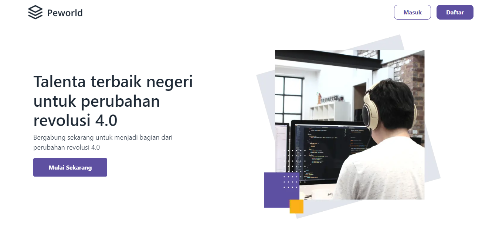
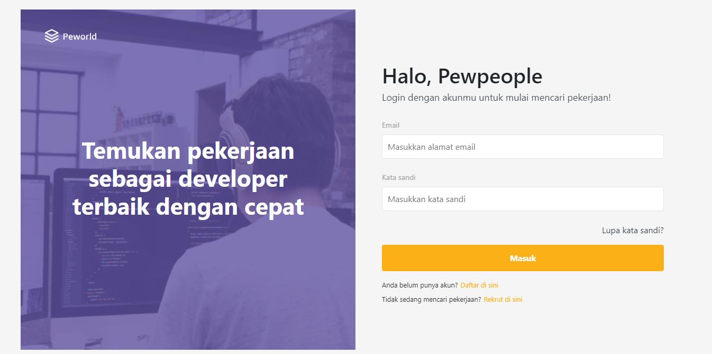
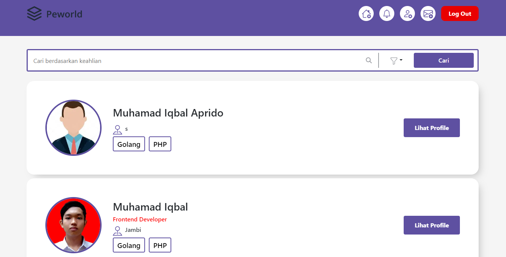
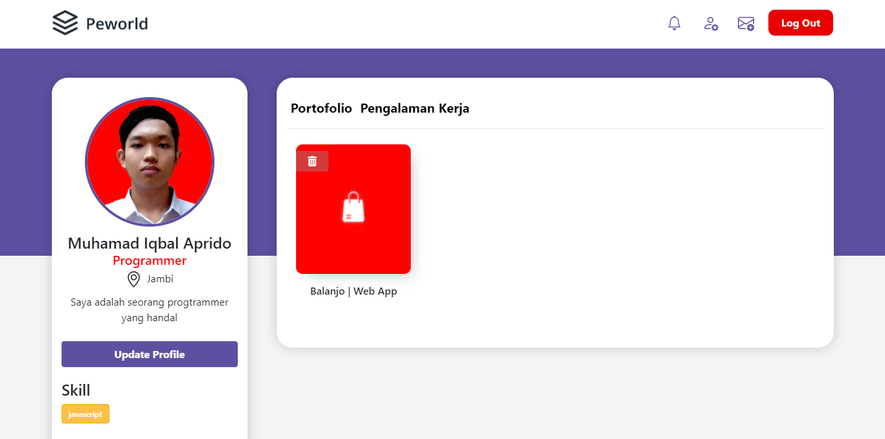

<br />
<p align="center">
<div align="center">
  
</div>
  <h3 align="center">Hire Job</h3>
  <p align="center">
    <a href="https://github.com/preedok/FE-JOB/"><strong>Explore the docs »</strong></a>
    <br />
    <a href="/">View Demo</a>
    ·
    <a href="/">Report Bug</a>
    ·
    <a href="/">Request Feature</a>
  </p>
</p>


<!-- TABLE OF CONTENTS -->
## Table of Contents

- [Table of Contents](#table-of-contents)
- [About The Project](#about-the-project)
  - [Built With](#built-with)
- [Getting Started](#getting-started)
  - [Prerequisites](#prerequisites)
  - [Installation](#installation)
  - [Setup .env](#setup-env)
- [Screenshots](#screenshots)
- [Contributing](#contributing)
- [Related Project](#related-project)
- [Contact](#contact)


<!-- ABOUT THE PROJECT -->
## About The Project

The Hirejob website application is an application that makes it easy for someone to find work and recruit people who are looking for work. This application is built using Express JS and Next JS. The features in this application are login, register, list of job seekers, job seeker details, edit profile, and chat to recruit job seekers.

### Built With

- [Bootstrap Css](https://getbootstrap.com/)
- [Next js](https://nextjs.org/)
- and other


<!-- GETTING STARTED -->
## Getting Started

### Prerequisites

This is an example of how to list things you need to use the software and how to install them.

* [nodejs](https://nodejs.org/en/download/)

### Installation

- Clone This Front End Repo
```
git clone https://github.com/preedok/FE-JOB/.git
```
- Go To Folder Repo
```
cd hirejob-client
```
- Install Module
```
npm install
```
- <a href="#setup-env">Setup .env</a>
- Type ` npm run dev` To Start Website
- Type ` npm run production` To Start Production

### Setup .env
Create .env file in your root project folder.
```
NEXT_PUBLIC_API_URL = [BACKEND_URL]
```

<!-- ROADMAP -->
## Screenshots

<table>
 <tr>
    <td></td>
    <td> </td>
  </tr>
   <tr>
    <td>Landing Page</td>
    <td>Login Recruiters</td>
  </tr>

  <tr>
    <td> </td>
     <td></td>
  </tr>
   <tr>
    <td>List Recruiters</td>
     <td>My Profile</td>
  </tr>
  
 
</table>


<!-- CONTRIBUTING -->
## Contributing

Contributions are what make the open source community such an amazing place to be learn, inspire, and create. Any contributions you make are **greatly appreciated**.

1. Fork the Project
2. Create your Feature Branch (`git checkout -b feature/AmazingFeature`)
3. Commit your Changes (`git commit -m 'Add some AmazingFeature'`)
4. Push to the Branch (`git push origin feature/AmazingFeature`)
5. Open a Pull Request


## Related Project
:rocket: [`Backend Hire Job`](https://github.com/preedok/BE-JOB/)

:rocket: [`Frontend Hire Job`](https://github.com/preedok/FE-JOB/)

:rocket: [`Demo Hire Job`](/)

<!-- CONTACT -->
## Contact

My Email : iqbalapreedo@gmail.com

Project Link: [https://github.com/preedok/FE-JOB/](https://github.com/Ipreedok/FE-JOB/)
